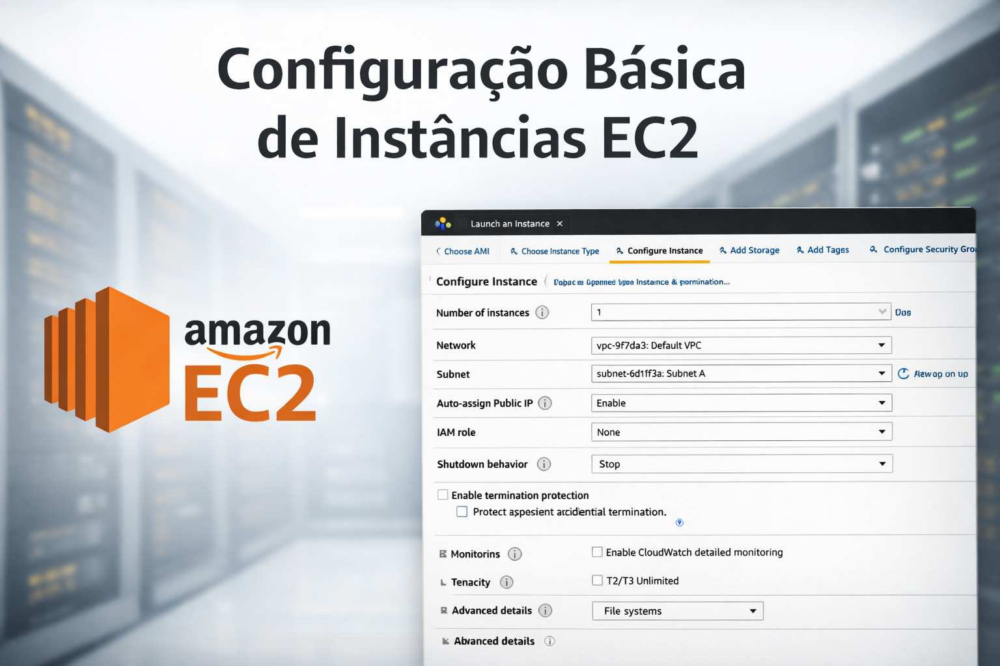

# Como imaginei a configuração do servidor (EC2)

Para o servidor da farmácia, eu escolhi uma configuração que não pesa no bolso, mas que dá conta do recado para começar.

  

### O que vai ser usado:
* **Modelo:** `t3.micro`. Escolhi essa porque ela entra no "nível gratuito" da AWS. Assim, a Abstergo Industries não gasta nada nos primeiros meses de teste.
* **Sistema:** Amazon Linux. É o padrão da AWS, mais leve e seguro para rodar o site e o sistema de vendas.
* **Espaço em disco:** 20 GB. É mais do que suficiente para começar a guardar os arquivos do sistema e o banco de dados inicial.

### Proteção básica (Segurança):
Criei uma regra simples de acesso:
1.  Qualquer pessoa na internet pode acessar o site (Portas 80 e 443).
2.  Somente eu (ou o técnico da empresa) posso entrar no servidor para fazer manutenção (Porta 22 - SSH).

**Por que isso é bom?**
Se a farmácia fizer uma promoção e muita gente entrar ao mesmo tempo, a gente consegue aumentar a potência desse servidor em poucos minutos. No servidor físico que eles têm hoje, isso seria impossível sem comprar peças novas.