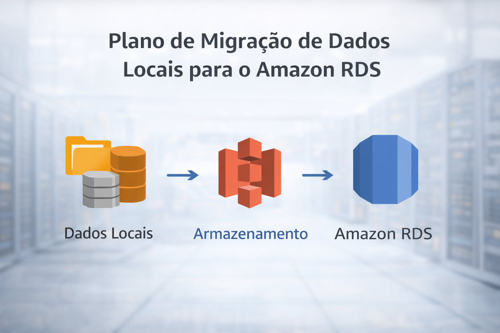

# Passo a passo da migração de dados

Aqui está como eu pretendo tirar os dados do estoque e dos clientes do computador atual e levar para o banco de dados novo (RDS).

  

1.  **Fazer a cópia (Backup):** Primeiro, eu tiro uma cópia de segurança de tudo que tem no banco de dados atual da farmácia.
2.  **Mandar para a Nuvem:** Vou subir esse arquivo de backup para o **Amazon S3** (que funciona como um "Google Drive" da AWS).
3.  **Criar o Banco Novo:** Vou ligar o **Amazon RDS** e configurar ele para aceitar os dados da farmácia.
4.  **Importar tudo:** Vou dizer para o RDS ler aquele arquivo que eu subi no S3. Assim, os dados entram no sistema novo de forma organizada.
5.  **Trocar a chave:** No final, eu mudo o endereço do sistema de vendas para apontar para a AWS. Se tudo estiver certo, a farmácia volta a operar já rodando na nuvem.

**Objetivo:** Fazer essa troca de madrugada ou no horário que a farmácia estiver fechada para ninguém ficar sem sistema.